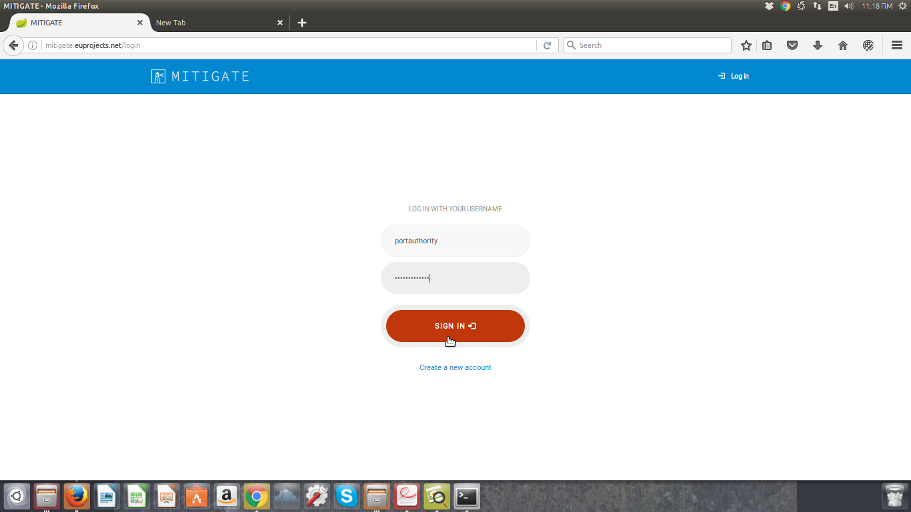

Risk assessment walkthrough
========

$project will solve your problem of where to start with documentation,
by providing a basic explanation of how to do it easily.

Look how easy it is to use:

    import project
    # Get your stuff done
    project.do_stuff()

Create Account
--------

- When a user access the MITIGATE site (https://mitigate.euprojects.net/) the following screen is shown:
.. image:: assets/Log.png

- Create developer account

Login
------------

- When a user access the MITIGATE site (https://mitigate.euprojects.net/) the following screen is shown:

.. image:: assets/Log.png

- Click the <Log in> button .

.. image:: assets/Log_1.png

- Provide your login credentials and click the <SIGN IN> button.

- Upon successful authentication the following screen will be presented.

.. image:: assets/Log_4.png

Logout
----------

- In order to perform logout  click the <Log-out > Button.

.. image:: assets/logout.png

- Upon successful logout the following screen will be presented.

.. image:: assets/logout_2.png

Support
-------

If you are having issues, please do not hesitate to contact us (pgouvas@gmail.com).

