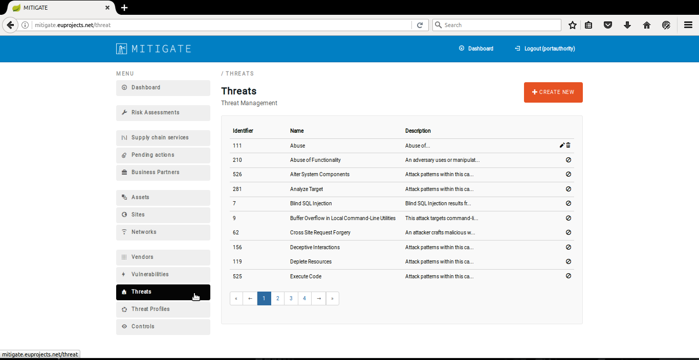

========
Threat Management
========

Declaring a new Threat
--------
- This use case describes the consecutive steps that have to be undertaken in order to declare a new threat.

- Login to the application

.. image:: assets/Log_4.png

- Place the cursor and click on ''Threats'' menu-item.

.. image:: assets/new_threat.png

- Click on "Create New" button

.. image:: assets/new_threat_2.png

- Provide threat credentials

.. image:: assets/new_threat_3.png

- Click on "Save" Button

.. image:: assets/new_threat_4.png

- You have successfully create a new threat. The new threat info appeared in “Threat Management” Panel.

.. image:: assets/new_threat_5.png

Edit a Threat   
--------
- This use case describes the consecutive steps that have to be undertaken in order to edit a threat.

- Place the cursor and click on "Threats" menu-item. 

- Press the "edit" button.

.. image:: assets/edit_threat_2.png

- Apply the requirement changes in "Threat Edit" panel.  

.. image:: assets/edit_threat_3.png

- Click on "Save" Button.

.. image:: assets/edi_threat_4.png

- You have successfully edit a threat. The changed threat info appeared in "Threat Management" Panel.

.. image:: assets/edit_threat_5.png

Delete a Threat
------------
- This use case describes the consecutive steps that have to be undertaken in order to declare a new threat.
- Login to the application

.. image:: assets/Log_4.png

    

