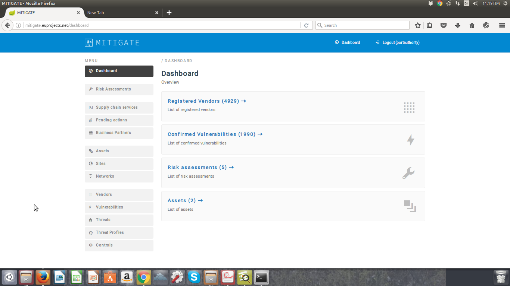

============
Control Management
============

Declaring a new control
-----------------------

- In order to declare a new control  several consecutive steps have to be undertaken .
- Initially the user must login.

- Click on “Control” Menu-item.

.. image:: assets/cc.png

- Click on “Create New” button.

.. image:: assets/cc_2.png

- Provide threat details such us (Name,Type,Description)

.. image:: assets/cc_3.png

- Upon succesful declaration, the new control appears in vendor management list.

.. image:: assets/cc_4.png

Managing a new control
----------------------

Delete a Control
----------------

